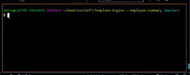
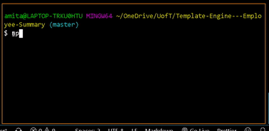

# Template Engine - Employee Summary

The application will prompt the user for information about the team manager and then information about the team members. 
The user can input any number of team members, and they may be a mix of engineers and interns. This assignment must also pass all unit tests. When the user has completed building the team, the application will create an HTML file that displays a nicely formatted team roster based on the information provided by the user.

## Usage demo

## Test demo

## Table of Contents

- [Description](#description)
- [Features](#features)
- [Getting-Started](#Getting-Started)
- [Installation](#installation)
- [Link](#link)
- [Technologies](#Technologies)
- [Author](#Author)
- [Acknowledgments](#Acknowledgments)

## Description

A simple github profile generator application with dynamically updated HTML and pdf based on user input. The output powered by Node.js and ES6. It uses the Axios, Inquirer, and html-pdf-to npm packages to generate a beautiful PDF document of a developer's GitHub profile based on their username.

## Features

- Quick and easy to use
- Options to choose general color available
- Displays: picture, name, company, location, GitHub URL, blog URL, count of repos, count of starred repos, count of followers, and count of people following

## Getting-Started

The application will be invoked with the following command: node index.js. The user will be prompted for their GitHub username as well as their favorite color. The app will then generate a html file and a pdf file with the user's GitHub information and favorite color set to the background.

## Link

- The sample ouput can be accessed via the link https://amitabh-k.github.io/Developer-Profile-Generator/

- The code can be accessed via the link  https://github.com/Amitabh-K/Developer-Profile-Generator

## Technologies

inquirer npm package
jest npm test package
HTML
CSS with Bootstrap
jest npm package

## Author

* **Amitabh Kumar**

## Acknowledgments

*Thanks to Josh Sherman as I drew inspiration from the article on "Interactive Command-line Prompts with Inquirer.js"  at https://alligator.io/nodejs/interactive-command-line-prompts/

* Ali Maqsood & David Bland's (instructors) help on the content delivery

